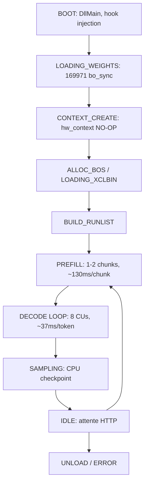

# FONCTIONNEMENT INTERNE FLM — State machine, IOCTLs, mémoire

## 19.1 State machine FLM complète (12 états)



Timings :
- BOOT→LOAD : ~0ms
- LOAD : ~4s (169971 bo_sync, poids 2.928 GB)
- CONTEXT_CREATE : ~2362ms overhead H6
- PREFILL : ~130ms par chunk (chunk si ctx>4096)
- DECODE : ~37ms/token NPU pur → 27 TPS théorique, 7.6 TPS réel (overhead HTTP)
- SAMPLING : CPU, <1ms

## 19.2 Pipeline decode (1 token = 8 compute units)

```
runlist_wait (~16ms)           ← orchestration globale
├── run_wait handle BB40 (~4.5ms) ← CU1: premières couches
├── run_wait handle BB30 (~1.1ms) ← CU2: head/tail léger
├── run_wait handle BC10 (~3.3ms) ← CU3
├── run_wait handle BC20 (~3.7ms) ← CU4
├── run_wait handle BC30 (~3.7ms) ← CU5
├── run_wait handle BC40 (~2.5ms) ← CU6
├── run_wait handle BC50 (~2.7ms) ← CU7
└── run_wait handle C158 (~2.5ms) ← CU8: dernières + lm_head
bo_sync final (~3)             ← sync buffer output
                              Total: ~37ms/token → 27 TPS NPU pur
                              Réel API: ~7.6 TPS (overhead HTTP)
```

8 handles → 8 groupes de couches Qwen3.5-9B (32 layers / 8 = 4 layers par CU)

## 19.3 IOCTLs (50 par token)

| IOCTL | Fonction Ghidra | RVA | Corps |
|-------|----------------|-----|-------|
| DMA_SUBMIT | `npu_dma_memcpy_nd` | 0x18003ade0 | 5514 octets |
| DMA_WAIT | `npu_dma_wait` | 0x18003c380 | 189 octets |
| SUSPEND/PREEMPT | `npu_preemption` | 0x18003c440 | 161 octets |
| RESUME | `npu_preemption_cmd` | 0x1800289d0 | 14 octets |
| ISSUE_TOKEN | `npu_issue_token_cmd` | 0x1800289b0 | 21 octets |
| DDR_CMD | `npu_ddr_cmd` | 0x180028980 | 28 octets |
| DMA_BLOCK_CMD | `npu_dma_block_cmd` | 0x1800289a0 | 14 octets |
| WRITE_CMD | `npu_write_cmd` | 0x180028a70 | 14 octets |

Commandes créées via `make_unique<>` et stockées dans `vector<unique_ptr<npu_cmd>>`.

## 19.4 Gestion mémoire FLM

- **Pas de cache BO** : allocation/free à chaque token via `create_bo_buffer`
- **3 create_bo_buffer** : spécialisations `<bfloat16_t>`, `<unsigned_char>`, `<float>`
- **Transfert DDR→SRAM AIE** : `npu_dma_memcpy_nd` (5514 B, plus grosse fonction)
- **Poids chargés par phase** : `_send_hidden_states`, `_send_linear_conv_weights`, `_send_rms_weights`, `_move_weights`, `_move_kv_cache`, `_receive_kv_cache`

## 19.5 KV Cache

- Stocké dans `buffer<bfloat16_t>` dans `qwen3_5vl_npu_sequence`
- Fonctions : `fill_kv_cache`, `get_k_cache`, `get_v_cache`, `_move_kv_cache`, `_move_linear_kv_cache`, `_receive_kv_cache`
- KV cache ABSENT entre requêtes (GEN2/GEN3 = même perf que GEN1)

## 19.6 Fonctions clés Ghidra (3418 listées, 14318 total)

| RVA | Fonction | Taille | Rôle |
|-----|----------|--------|------|
| 0x180057550 | `prefill` | 402 B | Point d'entrée prefill |
| 0x18004e8d0 | `_prefill_with_mm` | 10820 B | Plus grosse fonction |
| 0x180051320 | `_prefill_with_mv` | 910 B | Prefill MV |
| 0x1800542b0 | `forward` (Impl) | 619 B | Forward layer |
| 0x180056e50 | `load_weights` (Impl) | 1312 B | Chargement poids |
| 0x180056b80 | `init_weights` | 321 B | Init embeddings |
| 0x180041140 | `register_xclbin` | 547 B | Enregistrement xclbin |
| 0x180030170 | `_setup_kernel` | 1135 B | Setup kernel NPU |
| 0x180058d60 | `set_context_length` | 835 B | Longueur contexte |
| 0x180059150 | `update_max_length` | 1186 B | Mise à jour max |
| 0x180052f30 | `_update_rope_values` | 418 B | RoPE |
| 0x18004a580 | `_gated_norm` | 1408 B | Gated normalization |
| 0x180059610 | `wait` (runlist) | — | Attente XRT |
| 0x18003ade0 | `npu_dma_memcpy_nd` | 5514 B | DMA memcpy |
| 0x18003c380 | `npu_dma_wait` | 189 B | Attente DMA |
| 0x180053ee0 | `create_runlist` | 31 B | Création runlist |
| 0x180044d70 | `make_unique<Gemm>` | 84 B | Instance Gemm |
| 0x180047f20 | `qwen3_5vl_npu::ctor` | 508 B | Constructeur public |
| 0x1800568e0 | `get_logits` (Impl) | — | Récupération logits |
